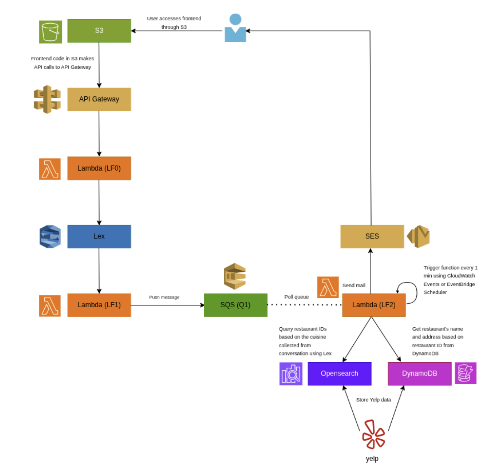

# Dining Concierge Chatbot

Cloud Computing and Big Data – Fall 2026  
Homework Assignment 1

## Overview

This project implements a serverless Dining Concierge chatbot using AWS services.

The chatbot collects a user's dining preferences through conversation and sends restaurant recommendations over email.

The application uses Amazon Lex for the chatbot, AWS Lambda for backend logic, SQS for asynchronous processing, OpenSearch for cuisine based restaurant lookup, DynamoDB for restaurant and user state storage, SES for email delivery, and EventBridge for scheduled processing.

The frontend is hosted using Amazon S3.

---

## Architecture



---

## Main Features

- Conversational restaurant recommendation chatbot using Amazon Lex
- S3-hosted web frontend
- API Gateway and Lambda-based backend
- SQS-based decoupled request processing
- 1,000+ Manhattan restaurants collected using Yelp API
- Restaurant data stored in DynamoDB
- Cuisine-based lookup using Amazon OpenSearch
- Restaurant recommendations sent using Amazon SES
- EventBridge invokes the recommendation worker every minute
- Extra-credit persistent search state using DynamoDB
- Users can request the same recommendations from their previous search

---

## Project Structure

```text
cloud-computing-assignment-1/
├── frontend/
│   └── chat.html
│
├── lambda-functions/
│   ├── LF0/
│   │   └── lambda_function.py
│   ├── LF1/
│   │   └── lambda_function.py
│   └── LF2/
│       └── lambda_function.py
│
├── other-scripts/
│   ├── configure_lf2_opensearch.py
│   ├── load_opensearch.py
│   ├── swagger.yaml
│   └── yelp_scraper.py
│
├── .gitignore
├── README.md
├── PROJECT_STRUCTURE.md
└── requirements.txt
```

---

## AWS Services Used

- Amazon S3
- Amazon API Gateway
- AWS Lambda
- Amazon Lex V2
- Amazon SQS
- Amazon DynamoDB
- Amazon OpenSearch Service
- Amazon SES
- Amazon EventBridge
- AWS IAM

---

## Additional Documentation

For a detailed explanation of the architecture, AWS components, scripts, data flow, and extra-credit implementation, see [Project_Structure.md](Project_Structure.md)
